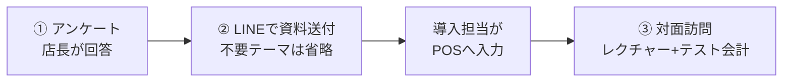

# ポッキリ.Night 初期設定キット 要件定義書

2026-09-25 · りょう

## 1. 概要

ポッキリ.Nightの導入時に店舗情報を集めるキットを、Claude Codeで3つの成果物として作ります。①導入アンケート(Googleフォーム)、②記入テンプレート(LINE・Excel)、③対面レクチャー資料(スライド)です。

**目的**

- 店舗の入力負担を最小にする(フォーム回答は15〜20分以内)
- 選択式・入力規則・記入例で、回答のブレと誤りを減らす
- キャストの個人情報やログイン情報を、LINE・フォーム・共有シートに残さない

**背景**

既存の[導入アンケート見本](https://claude.ai/artifact/QmPaF9YXqLupyow6kwDPfL)は、POSの設定項目を13セクション・回答目安30〜45分で1枚にまとめたものです。項目の網羅性は高い一方、表形式の入力と機密情報まで1枚に入っており、店舗の負担が大きくなっています。本キットでは、この見本の項目を正とし、答えの形に合わせて3つの経路へ振り分け直します。

**利用者**

| 利用者 | 関わる成果物 | 役割 |
|---|---|---|
| 店長・オーナー | ①②③ | フォーム回答、LINEで資料送付、訪問時に給与情報をPOSへ直接入力 |
| キャスト本人 | ③ | 訪問時に自分の個人情報を端末で入力、身分証を提示 |
| 導入担当(自社) | ②③ | LINEの内容をPOSへ入力、訪問時のレクチャーとテスト会計 |

**スコープ**

- 対象:3成果物の作成と、その元になる項目定義ファイル
- 対象外:POS本体の改修、回答データのPOSへの自動取り込み(未決事項に記載)

## 2. 成果物と振り分け方針

3つの成果物は、1つの項目定義ファイル(`spec/items.yaml`)から生成します。項目の追加や変更は、このファイルだけを直せば全成果物に反映される構成にします。

| No | 成果物 | 出力形式 | 使う人 | 所要時間の目安 |
|---|---|---|---|---|
| ① | 導入アンケート | Googleフォーム(GASで自動生成)+HTMLプレビュー | 店長・オーナー | 15〜20分 |
| ② | 記入テンプレート | LINE貼り付け用テキスト+Excel(.xlsx) | 店長・オーナー | テーマごとに5〜10分 |
| ③ | 対面レクチャー資料 | スライド(PDF・PPTX)+当日チェックリスト | 導入担当・店舗全員 | 訪問1回 90〜120分 |



①の回答で「使わない」とされた機能は、②のテンプレートと③のスライドから省きます。

**振り分けの基準**

- ①アンケート:店舗につき答えが1つで、選択肢か数字1つで答えられる項目
- ②テンプレート:件数が店舗ごとに違い、行が増えていく項目。既存のメニュー表などは写真で代用可
- ③対面:機密情報(給与・個人情報・ログイン)と、画面を触らないと誤りやすい設定
- 質問しない:日本の制度で決まっている値(消費税率10%・8%)は初期値で固定

**既存見本の全項目の振り分け**

| 既存セクション | 項目 | 振り分け |
|---|---|---|
| ①店舗情報 | 店舗名・業態・郵便番号・電話・住所・事業者名・最寄り駅 | ① |
| ①店舗情報 | 一部/二部の切り替え時刻 | ① |
| ①店舗情報 | 許可証・届出 | ③ 訪問時に撮影 |
| ②料金セット | セット(時間・料金・延長) | ② |
| ②料金セット | 延長メニュー | ② |
| ②料金セット | 延長アラート・自動延長・サービス料・ハウスチャージ・人数分課金 | ① |
| ②料金セット | 総額の端数処理・売上目標表示・達成時インセンティブ・深夜割増 | ① |
| ③指名・バック | 指名区分 | ② |
| ③指名・バック | ヘルプへの売上付与・バック端数の丸め | ① |
| ③指名・バック | バックルール(10パターン)・ボトル折半 | ③ 個別ヒアリングで設定 |
| ④税・インボイス | 登録番号・内税/外税 | ① |
| ④税・インボイス | 税率(10%・8%) | 質問しない(固定) |
| ⑤決済方法 | 上乗せ手数料・カード決済手数料 | ① |
| ⑥商品メニュー | カテゴリー・商品・原価・キャストドリンク・ボトルキープ・税区分 | ② |
| ⑥商品メニュー | 商品ごとの種類・時価 | ③ 転記後に確認 |
| ⑦卓 | 卓の一覧 | ② |
| ⑦卓 | フロアマップの配置 | ③ |
| ⑧流入経路 | 集計タグ | ① |
| ⑨経費カテゴリ | カテゴリ・原価に含めるか | ① |
| ⑩レジ・日報 | レジ金・過不足の範囲・日報PDF | ① |
| ⑪プリンター | 用紙幅・自動印字・領収書デザイン・刷る内容・収入印紙・採番・印刷するもの・キッチン伝票 | ① |
| ⑪プリンター | 機器名 | ③ 現物で確認 |
| ⑫メンバー台帳 | 源氏名・区分・スタッフの氏名と職種 | ② |
| ⑫メンバー台帳 | 時給・ランク・源泉区分・交通費 | ③ 店舗がPOSへ直接入力 |
| ⑫メンバー台帳 | 個人情報(本名・生年月日・電話・住所・口座・緊急連絡先・身分証) | ③ キャスト本人が入力 |
| ⑬給与運用 | 締め日・支払日・時給の丸め・福利厚生費・交通費の条件・遅刻控除・日払い上限・給率の警告 | ① |
| ⑬給与運用 | 源泉率 | ① 主に使う区分のみ。率は初期値 |
| ⑬給与運用 | 送りエリア別の金額・繁忙時間帯の時給 | ② |

## 3. 成果物① 導入アンケート(Googleフォーム)

Google Apps Script(`FormApp`)で、全11セクションのフォームを自動生成します。同じ定義から、既存見本と同じデザインのHTMLプレビューも出力します。

**共通仕様**

- 冒頭に「所要時間 約15〜20分」「回答期限」「わからない項目は『訪問時に相談』でOK」を表示する
- すべての選択式の質問に「わからない・訪問時に相談」を入れる
- 必須は店舗名・電話番号・業態のみ。それ以外は任意にして、途中で止まらないようにする
- 「使う/使わない」の質問は、セクション分岐(`PageBreakItem`+`goToPage`)で詳細を出し分ける
- 数値の質問は入力規則で数字のみ、範囲外はエラー文を表示する
- 回答はGoogleスプレッドシートに自動で連携する

**入力規則**

| 対象 | 規則 | エラー文 |
|---|---|---|
| インボイス登録番号 | `^T\d{13}$` | 「T」から始まる14文字で入力してください(例:T1234567890123) |
| 郵便番号 | `^\d{3}-?\d{4}$` | 例:220-0011 の形で入力してください |
| 電話番号 | `^0\d{1,4}-?\d{1,4}-?\d{3,4}$` | 例:045-000-0000 の形で入力してください |
| 金額(円) | 整数・0以上 | 数字のみで入力してください(カンマ不要) |
| 率(%) | 0〜100 | 0〜100の数字で入力してください |

### S1 はじめに

| 質問 | 形式 | 選択肢・補足 |
|---|---|---|
| 店舗名(必須) | 短文 | 例:クラブ ポッキリ |
| 回答者のお名前・役職 | 短文 | 例:山田(店長) |
| 業態(必須) | ラジオ | キャバクラ・ラウンジ/ガールズバー・バー・スナック/ホスト/その他 |

### S2 店舗の基本情報

| 質問 | 形式 | 選択肢・補足 |
|---|---|---|
| 郵便番号・住所 | 短文×2 | 領収書に使うことを補足 |
| 電話番号(必須) | 短文 | 入力規則あり |
| 事業者名(法人名) | 短文 | 店名と同じなら空欄でOK |
| 最寄り駅 | 短文 | 交通費の計算に使うことを補足 |
| 一部・二部(深夜)の区別 | ラジオ | 使わない/使う → 開始時・終了時(0〜23のプルダウン) |

### S3 料金のルール

| 質問 | 形式 | 選択肢・補足 |
|---|---|---|
| サービス料 | ラジオ | なし/10%/15%/20%/その他(数字) |
| ハウスチャージ | 数値 | 円。なければ0 |
| 人数分で課金するもの | チェック | セット・延長を人数分/ハウスチャージを人数分 |
| 総額の端数処理 | プルダウン×2 | 単位:なし/10円/100円/500円/1000円、方法:切り捨て/切り上げ |
| 延長アラート | プルダウン | 終了の5分前/10分前/15分前 |
| 自動延長 | ラジオ | 使わない/使う → 何分ごと・何円。「主にバー・スナック向け」と補足 |
| 深夜割増 | ラジオ | 使わない/使う → 基準時刻・1セットあたりの金額 |
| 売上目標の表示と達成時インセンティブ | ラジオ | 使わない/使う → 1人あたり(円)・対象人数 |

### S4 指名・バック

| 質問 | 形式 | 選択肢・補足 |
|---|---|---|
| ヘルプのキャストにも売上を付けるか | ラジオ | 付ける(標準)/付けない |
| 複数キャストでの売上折半 | ラジオ | 使わない/使う/訪問時に相談 |
| バック端数の丸め | プルダウン | 1円/10円/100円 |
| バックの決め方 | 説明文のみ | 「10パターンから、訪問時に一緒に決めます」と表示し、質問はしない |

### S5 税・インボイス

| 質問 | 形式 | 選択肢・補足 |
|---|---|---|
| インボイス登録 | ラジオ | 登録している → 登録番号/登録していない |
| 価格の表示方法 | ラジオ | 内税(税込表示)/外税(税抜表示) |

税率は質問しません。説明文で「10%(軽減8%)で設定します」と表示します。

### S6 決済方法

| 質問 | 形式 | 選択肢・補足 |
|---|---|---|
| カード払いの上乗せ手数料 | ラジオ | なし/あり → %。カード会社の規約で禁止の場合がある旨を注意書き |
| 売掛の上乗せ手数料 | ラジオ | なし/あり → % |
| カード決済手数料(店舗負担) | 数値 | %。内税表示のときのみ自動適用される旨を補足 |

### S7 レジ・日報

| 質問 | 形式 | 選択肢・補足 |
|---|---|---|
| いつものレジ金(釣銭準備額) | 数値 | 円。例:50000 |
| 現金過不足の許容範囲 | 数値×2 | 下限(マイナス円)・上限(プラス円) |
| 日報をPDFで出力するか | ラジオ | する/しない |

### S8 プリンター・伝票

| 質問 | 形式 | 選択肢・補足 |
|---|---|---|
| レシートプリンター | ラジオ | ある/これから用意/使わない(→S9へ) |
| 用紙幅 | ラジオ | 58mm/80mm/わからない(訪問時に確認) |
| 自動印字(CloudPRNT) | ラジオ | 使う/使わない/わからない |
| 領収書のデザイン | ラジオ | シンプル/二重罫/タイトル帯付き。各選択肢の直前に見本画像を置く |
| 領収書に刷る内容 | チェック | 住所/事業者名/インボイス登録番号(店舗名・電話は必ず印字) |
| 収入印紙の案内 | 数値+ラジオ | この金額以上で表示(初期値50000円)、判定:お預かり金額/お会計金額 |
| 伝票番号の採番 | ラジオ | 使わない/使う → 接頭辞・開始番号・リセット単位 |
| 印刷するもの | チェック | 概算伝票/会計伝票/精算伝票/領収書 |
| キッチン伝票 | ラジオ | 使わない/使う → 印刷するカテゴリ(ドリンク/ボトル/フード/その他) |

### S9 集計・経費

| 質問 | 形式 | 選択肢・補足 |
|---|---|---|
| 来店きっかけの集計タグ | チェック | 新規/リピーター/紹介/SNS/ビラ/看板/その他(記述) |
| 使う経費カテゴリ | チェック | 仕入/広告宣伝費/送迎費/人件費(時給以外)/その他(記述) |
| 原価に含めるカテゴリ | チェック | 上と同じ選択肢。粗利計算に使うことを補足 |

### S10 給与のルール

| 質問 | 形式 | 選択肢・補足 |
|---|---|---|
| 締め日・支払日 | プルダウン×2 | 5日/10日/15日/20日/25日/末日 |
| 時給の丸め | プルダウン×2 | 1分/5分/10分/15分/30分、切り捨て/切り上げ |
| 主に使う源泉区分 | ラジオ | 報酬源泉10.21%/ホステス源泉(日額5,000円控除)/給与源泉/訪問時に相談 |
| 交通費の支給条件 | 数値×2 | 対象になる最低勤務時間・フル日とみなす勤務時間 |
| 福利厚生費 | 数値+ラジオ | 円、期間ごと/出勤日ごと |
| 遅刻控除 | ラジオ | 使わない/使う → 1分あたりの控除(円)・猶予(分)・1日の上限(円) |
| 日払いの上限 | 数値 | 円。空欄なら上限なし |
| 給率の警告しきい値 | 数値 | %。任意 |

個々のキャストの時給・源泉区分・交通費は、このフォームでは聞きません(③で店舗がPOSへ直接入力)。

### S11 訪問日の調整

| 質問 | 形式 | 選択肢・補足 |
|---|---|---|
| 訪問の希望日時 | 日付+時刻 | 第1〜第2希望 |
| 当日同席できる人 | チェック | オーナー/店長/スタッフ/厨房/キャスト |
| 気になっていること | 段落 | 任意 |

送信後の画面に、②のLINEテンプレートの受け取り方を表示します。

## 4. 成果物② 記入テンプレート(LINE・Excel)

6テーマそれぞれに、LINEへそのまま貼れる箇条書きテンプレートと、同じ内容のExcelシートを用意します。店舗はどちらか書きやすい方を選べます。

**共通仕様**

- LINEは1メッセージ1テーマ。冒頭に【テーマ名】を入れ、受け取り側が探しやすくする
- 各テンプレートの先頭に記入例を1〜2件入れ、「例)」を消して上書きしてもらう
- 区切りは「/」に統一する。金額は数字のみ(カンマ・「円」なしでも可)
- 写真で代用できるテーマは、最初に「写真だけでもOK」と明記する
- 時給・個人情報は送らないよう、名簿テンプレートに注意書きを入れる
- Excelは1ブック6シート。1行目見出し、2行目に灰色の記入例、数値列は入力規則、選択肢はプルダウン
- ①で「使わない」とされたテーマは送らない(例:自動延長なしなら延長の自動欄を省く)

### テーマ1 料金セット・延長メニュー

```
【料金セット・延長】
※料金表の写真だけでもOKです

■セット
・セット名/時間(分)/料金
・例)セット1/60/8000
・例)VIPセット/60/15000

■延長
・延長名/時間(分)/料金
・例)延長30分/30/4000
・例)延長60分/60/8000
```

Excelシート「料金セット」:セット名|時間(分)|料金(円)|延長(分)|延長料金(円)。シート「延長メニュー」:名前|時間(分)|料金(円)|現場に出す(プルダウン)

### テーマ2 指名区分

```
【指名区分】
・名称/指名料/バックの決め方(円 or 指名料の%)
・例)本指名/3000/1000円
・例)場内指名/2000/50%
・例)同伴/3000/1000円
・例)ヘルプ/0/なし
※バックの細かいルールは訪問時に一緒に決めます
```

Excelシート「指名区分」:名称|指名料(円)|課金単位(プルダウン)|バックの決め方(円/%)|金額または率

### テーマ3 商品メニュー

```
【商品メニュー】
※メニュー表の写真だけでもOKです
※写真の場合、下の「キャストドリンク」「ボトルキープ」だけ教えてください

・カテゴリー/商品名/金額
・例)シャンパン/ヴーヴクリコ/28000
・例)ソフトドリンク/ウーロン茶/800

■キャストドリンクになる商品
・例)ウーロン茶、ハイボール

■ボトルキープできる商品
・例)鏡月、ヴーヴクリコ
```

Excelシート「商品メニュー」:カテゴリー|種別(ドリンク/ボトル/フード/その他)|商品名|価格(円)|原価(任意)|キャストドリンク(○)|ボトルキープ(○)|税区分(標準10%/軽減8%)

### テーマ4 卓

```
【卓】
※お店の配置がわかる写真や手書きの図でもOKです

・卓名を1行に1つ
・例)VIP1
・例)カウンター
・例)個室A
```

Excelシート「卓」:卓名|席数(任意)。配置は訪問時にPOS画面で決める旨を記載

### テーマ5 キャスト・スタッフ名簿

```
【キャスト・スタッフ名簿】
※在籍表やシフト表の写真でもOKです
※時給や本名・住所などの個人情報は送らないでください
(時給は訪問時にお店の方がPOSへ直接入力します)

■キャスト
・源氏名/ランク(あれば)/区分
・例)ココ/レギュラー/在籍
・例)りん/なし/体験入店

■スタッフ
・名前/職種
・例)山田/ボーイ
・例)田中/キッチン
```

Excelシート「名簿」:源氏名または名前|キャスト/スタッフ(プルダウン)|ランクまたは職種|在籍/体験入店(プルダウン)。時給・個人情報の列は作らない

### テーマ6 送り・繁忙時間帯(該当する店舗のみ)

```
【送り・繁忙時間帯】
■送りエリアごとの送り代
・エリア名/送り代
・例)みなとみらい/1500
・例)関内/1000

■時給を上げる時間帯(ある場合のみ)
・開始/終了/倍率または加算額
・例)22:00/24:00/1.2倍
```

Excelシート「送り・繁忙」:エリア名|送り代(円)、開始|終了|倍率または加算額

**送付の案内文**

各テンプレートの前に送る案内文も、同じ定義ファイルから生成します。

```
アンケートのご回答ありがとうございます。
次に、下の内容をLINEで送ってください。

テーマごとに1通ずつ送っていただけると助かります。
写真でOKのものは、撮って送るだけで大丈夫です。

わからない所は空欄のままで構いません。
訪問時に一緒に確認します。
```

## 5. 成果物③ 対面レクチャー資料(スライド)

訪問当日にタブレットやPCで見せながら進める操作レクチャー資料を、Marp(Markdown)で作り、PDFとPPTXに出力します。記入もLINE報告も求めず、その場で操作して覚えてもらう内容だけを載せます。

**共通仕様**

- 16:9、1スライド1操作。本文は3〜5行まで
- 操作スライドは「手順(番号付き)」「画面のスクリーンショット枠」「やってみよう」の3段構成
- スクリーンショットは`slides/images/`の差し替え用プレースホルダーにする
- 各章の最後に「できたらチェック」欄を置き、当日チェックリスト(A4・1枚)にも同じ項目を出す
- ①の回答で使わない機能の章(キッチン伝票など)は、ビルド時の設定で除外できるようにする
- 所要時間は全体で90〜120分。章ごとの目安時間をスライド右上に表示する

**章立て**

| 章 | タイトル | 主な内容 | 同席してほしい人 | 目安 |
|---|---|---|---|---|
| 0 | 本日の流れ | 表紙、当日の進め方、所要時間 | 全員 | 3分 |
| 1 | 最初の準備 | 許可証の撮影、ログインIDとパスワードの設定、スタッフごとの権限。ID等はLINEで送らないことを説明 | オーナー・店長 | 10分 |
| 2 | 卓の配置 | フロアマップ上で卓をドラッグして配置 | 店長 | 5分 |
| 3 | 接客の基本の流れ | 入店→セット開始→延長(アラート・自動延長)→指名追加→会計 | 店長・スタッフ | 15分 |
| 4 | キャストの付け方 | 指名・場内・同伴・ヘルプの付け方、付け替え、売上の折半 | 店長・スタッフ | 10分 |
| 5 | バックの決め方 | 10パターンから店舗のルールを選び、その場で設定 | オーナー・店長 | 15分 |
| 6 | テスト会計 | サービス料・端数処理・税・カード手数料が意図どおりか、金額で答え合わせ | 店長 | 10分 |
| 7 | 訂正と取消 | 伝票の修正・取消の手順と、操作できる人の権限 | オーナー・店長 | 5分 |
| 8 | プリンター | 接続、用紙交換、試し刷り、領収書デザインの最終決定 | 店長・スタッフ | 10分 |
| 9 | キッチン伝票(使う場合) | 注文から厨房への印刷の流れ | 厨房 | 5分 |
| 10 | レジ | レジ開け、レジ締め、過不足が出たときの処理、日報 | 店長・スタッフ | 10分 |
| 11 | メンバー登録 | 時給・ランク・源泉区分・交通費を店舗がPOSへ入力(最初の1〜2人は一緒に)、キャスト本人の個人情報入力、身分証の確認 | オーナー・店長・キャスト | 15分 |
| 12 | 出退勤と遅刻 | 打刻の操作、遅刻控除のかかり方 | キャスト・スタッフ | 5分 |
| 13 | 困ったとき | 問い合わせ先、よくある質問、当日チェックリストの確認 | 全員 | 5分 |

**操作スライドの記述例(3章)**

```markdown
---
## 延長をつける 〔目安 3分〕

1. 卓をタップする
2. 「延長」ボタンから時間を選ぶ
3. 伝票の合計が増えたことを確認する


**やってみよう:** 卓「VIP1」に延長30分をつける
```

**当日チェックリスト(A4)**

- 章ごとに「できた」のチェック欄と、担当者のサイン欄を置く
- 最後に「テスト会計の金額が正しい」「プリンターで領収書が出た」「全キャストが登録済み」の3項目を大きく載せる

## 6. 共通ルール

3成果物とも、同じ表記・文章・デザイン・個人情報のルールに従います。

**表記**

- 金額は「円」、桁区切りのカンマ付きで表示する(入力はカンマなしでも受け付ける)
- 時刻は24時間表記。翌朝は「5時(翌朝)」のように補足する
- 用語は「キャスト」「スタッフ」「卓」「伝票」「バック」に統一する
- 製品名の表記は1つに統一する(未決事項を参照)

**文章**

- 1行は20〜35文字を目安にし、主語や接続詞の直後で改行しない
- 2〜3行ごとに空行を入れて段落を分ける
- 1文の読点は1〜2個まで。多くなる場合は文を分ける
- 専門用語には、初出で一言の説明を添える(例:CloudPRNT=注文を自動で印刷する仕組み)

**デザイン**

- HTMLプレビューとスライドは、既存見本の配色(アクセント #673ab7、背景 #f0ebf8)と書体(Noto Sans JP)を踏襲する
- スマホでの閲覧を前提に、文字は14px以上、タップ領域は44px以上

**個人情報・機密情報**

- キャストの本名・生年月日・住所・電話・口座・緊急連絡先・身分証は、フォーム・LINE・Excelのどこにも項目を作らない
- 時給・ランク・源泉区分・交通費など個人ごとの給与情報も、同様に項目を作らない
- ログインIDとパスワードは、どの成果物にも記載欄を作らず、訪問時に設定する
- 許可証は訪問時に撮影し、LINEでの送付を求めない

## 7. Claude Codeでの実装方針

項目定義`spec/items.yaml`を唯一の正とし、そこから①②③を生成するスクリプト群を作ります。Claude Codeには、下のフェーズ順に1つずつ依頼します。

**技術構成**

| 用途 | 技術 |
|---|---|
| 項目定義 | YAML(`spec/items.yaml`)+JSON Schemaで検証 |
| ① Googleフォーム | Google Apps Script(`FormApp`)、`clasp`でデプロイ |
| ① HTMLプレビュー | 既存見本のHTMLをテンプレート化し、YAMLから描画 |
| ② Excel | Python+openpyxl(入力規則・プルダウン・記入例の灰色表示) |
| ② LINEテキスト | Python+Jinja2で`.txt`を出力 |
| ③ スライド | Marp CLIでPDF・PPTXを出力 |
| テスト | pytest(生成物の検証)、GASはテスト用フォームで手動確認 |

**ディレクトリ構成**

```
pokkiri-onboarding-kit/
├── CLAUDE.md                 # Claude Code向けのルール
├── spec/
│   ├── items.yaml            # 全項目の定義(振り分け・形式・選択肢・規則)
│   └── items.schema.json
├── form/
│   ├── src/createForm.gs     # YAMLから生成したフォーム作成スクリプト
│   └── preview/index.html    # HTMLプレビュー
├── templates/
│   ├── line/                 # テーマ別の.txt(案内文を含む)
│   └── excel/初期設定_記入シート.xlsx
├── slides/
│   ├── lecture.md            # Marp
│   ├── checklist.md          # 当日チェックリスト
│   └── images/               # スクリーンショット差し替え用
├── scripts/
│   ├── build_form.py
│   ├── build_templates.py
│   └── build_slides.py
└── tests/
```

**items.yamlの1項目の形**

```yaml
- id: service_charge
  section: S3            # ①のセクション
  route: form            # form / template / onsite / fixed
  label: サービス料
  type: radio
  options: [なし, 10%, 15%, 20%, その他]
  other: {type: number, unit: "%", min: 0, max: 100}
  unknown_option: true   # 「わからない・訪問時に相談」を付ける
  hint: 会計の小計にかける割合です
  source: 既存見本 ②料金セット
```

**フェーズ**

| フェーズ | 内容 | 完了の条件 |
|---|---|---|
| 1 | 既存見本HTMLから全項目を抽出し、`items.yaml`を作る。本書2章の振り分けを`route`に反映 | 既存見本の全項目が漏れなくYAMLにある |
| 2 | ①のGASとHTMLプレビューを生成 | テスト用フォームで分岐と入力規則が動く |
| 3 | ②のLINEテキストとExcelを生成 | 6テーマ分が本書4章どおりに出力される |
| 4 | ③のMarpスライドとチェックリストを生成 | PDF・PPTXが出力され、章の除外設定が効く |
| 5 | テストと文章チェック | 8章の受け入れ基準をすべて満たす |

**CLAUDE.mdに書くこと**

- `spec/items.yaml`が唯一の正。成果物のファイルを手で直さず、YAMLかテンプレートを直して再生成する
- 個人情報・給与・ログイン情報の項目は、どの成果物にも作らない(6章)
- 文章は6章のルールに従う
- 変更後は`make all && pytest`を実行して結果を報告する

**最初に渡すプロンプト(フェーズ1)**

```
このリポジトリは、POS「ポッキリ.Night」の導入時に
店舗情報を集めるキットです。要件は docs/requirements.md にあります。

まずフェーズ1だけを行ってください。
reference/survey_sample.html の SECTIONS 定義から全項目を抽出し、
spec/items.yaml と spec/items.schema.json を作成してください。

各項目の route は、要件定義書の2章「既存見本の全項目の振り分け」に従ってください。
最後に、抽出した項目数と route ごとの件数を表で報告してください。
```

要件定義書は`docs/requirements.md`、既存見本は`reference/survey_sample.html`としてリポジトリに置いてから始めます。

## 8. 受け入れ基準とテスト

次の項目をすべて満たした時点で完成とします。自動で確かめられるものはpytestに入れます。

**共通**

- [ ] 既存見本の全項目が`items.yaml`にあり、`route`が空の項目がない(自動)
- [ ] 個人情報・給与・ログイン情報の項目が、①②のどこにも出力されていない(禁止語リストで自動検査)
- [ ] 6章の文章ルール(1行の長さ・読点の数)を満たしている(自動で警告)

**① 導入アンケート**

- [ ] 全11セクションが生成され、「使う/使わない」で詳細が出し分けられる
- [ ] 登録番号・郵便番号・電話番号・金額・率の入力規則が働き、エラー文が出る
- [ ] すべての選択式に「わからない・訪問時に相談」がある
- [ ] 店長役の社内メンバーが、スマホで20分以内に回答を終えられる
- [ ] 回答がスプレッドシートに1行で記録される

**② 記入テンプレート**

- [ ] 6テーマのLINEテキストが、LINEに貼っても崩れない(スマホで目視)
- [ ] Excelの記入例が灰色で、数値列に入力規則、選択列にプルダウンがある
- [ ] 名簿テンプレートに、時給・個人情報を送らない注意書きがある

**③ 対面レクチャー資料**

- [ ] 13章がPDFとPPTXで出力され、章の除外設定が効く
- [ ] 操作スライドがすべて「手順・画面枠・やってみよう」の構成になっている
- [ ] 当日チェックリストがA4で1枚に収まる
- [ ] 導入担当が、資料だけを見て120分以内に模擬訪問を終えられる

## 9. 未決事項

フェーズ1に入る前に、次の点を決めておく必要があります。
- [ ] **深夜割増の意味:** 当初の項目では「キャストの時給の◯%アップ」でしたが、既存見本(POSの実画面)では「お客様の会計に定額を1回加算」です。両方が必要か、どちらか一方かを決める
- [ ] **製品名の表記:** 「ポッキリ.Night」と「ポッキリ.night」が混在している。どちらに統一するか
- [ ] **領収書デザインの見本画像:** Googleフォームの選択肢そのものには画像を付けられないため、質問の直前に画像を置く方式でよいか。画像素材は誰が用意するか
- [ ] **自動延長の表示条件:** 既存見本では業態がバー系のときだけ表示。フォームでは業態で分岐させるか、全店舗に聞いて補足文で案内するか
- [ ] **回答の取り込み:** フォームとLINEの内容を導入担当が手で入力するか、POSへのインポート機能(CSVなど)を用意するか
- [ ] **スクリーンショット:** スライド用のPOS画面画像を、どの環境(デモ店舗など)から撮るか
- [ ] **ホスト業態:** 用語(キャスト/ホスト)や指名区分の記入例を、業態ごとに出し分けるか
